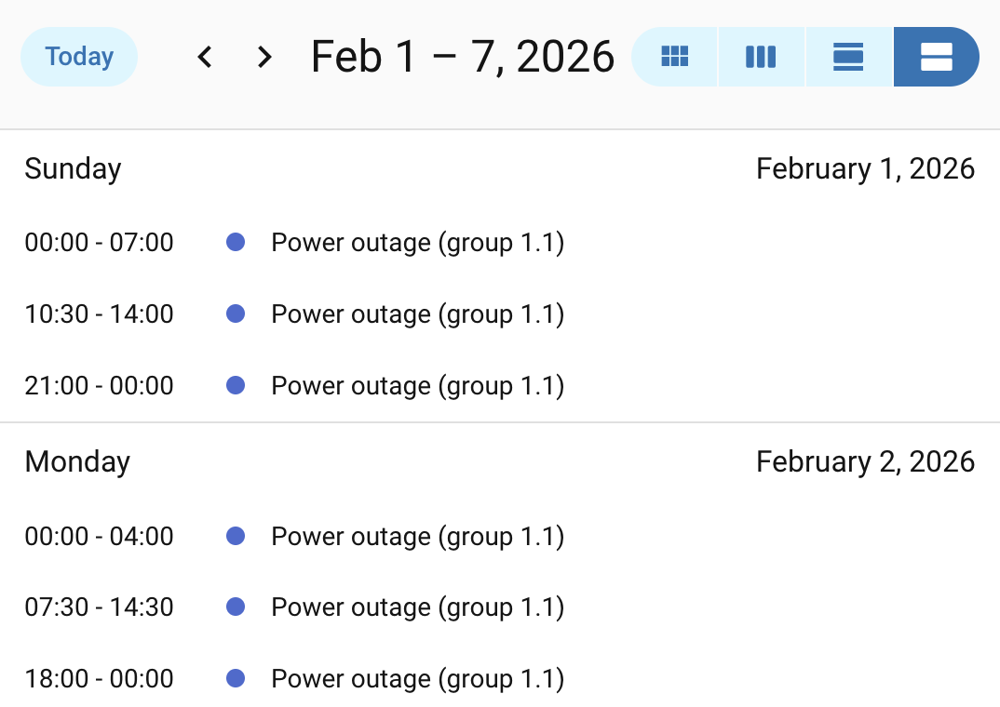
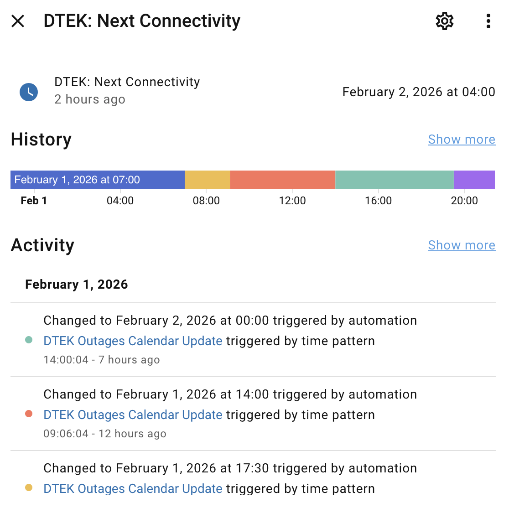
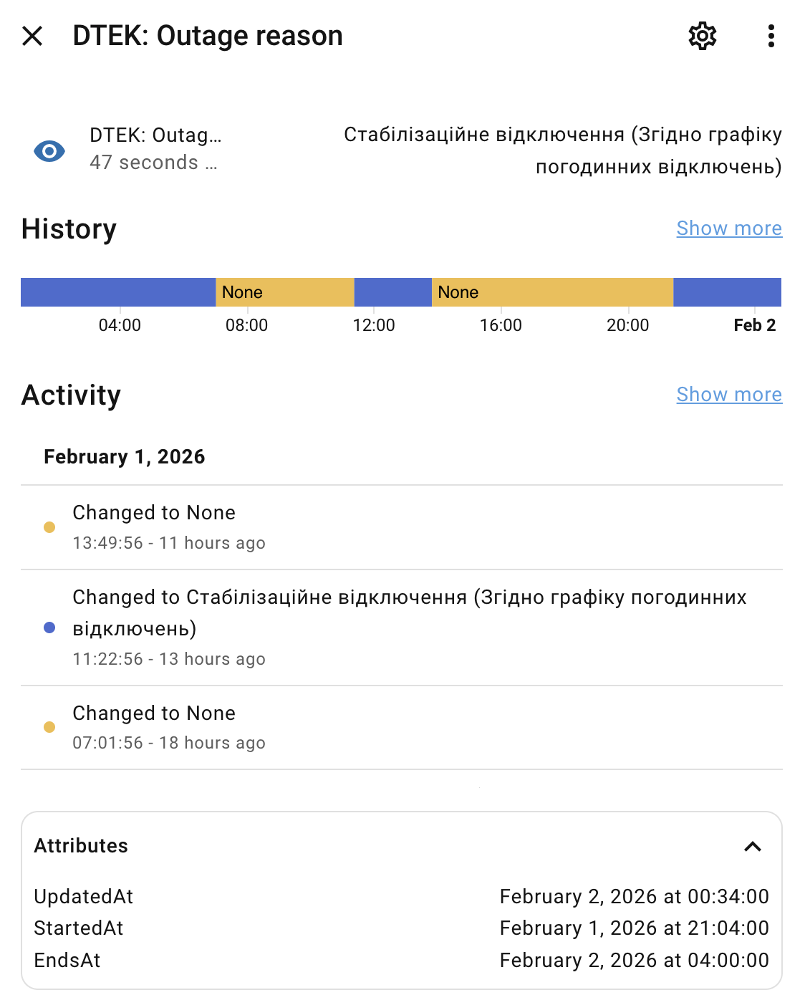
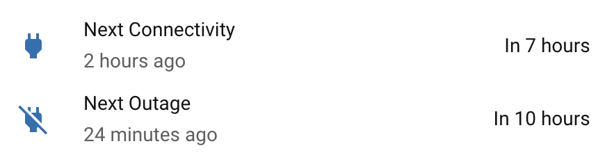
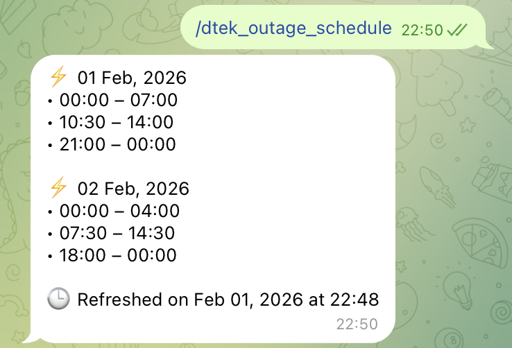
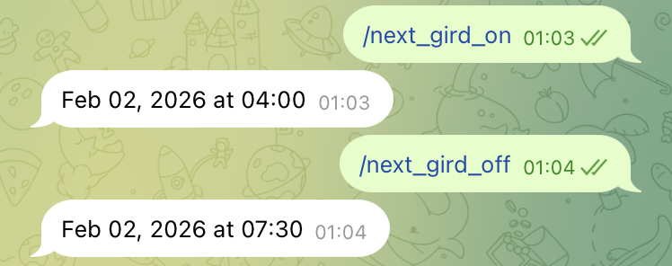

# DTEK Outages Checker

## Why does this exist?

I initially used [ha-yasno-outages](https://github.com/denysdovhan/ha-yasno-outages), which you may also consider (offers EN, UK, and NL locales and monitoring of multiple addresses). Yasno does expose a REST API - something the DTEK portal lacks - but in practice that API often serves delayed data. It appears to be refreshed on a coarse schedule, so meaningful updates are not propagated promptly. As a result, the API looks good from an integration standpoint but is of limited operational value: outage schedules can change during the day, and the updated information may arrive too late to be useful. By that point, automations relying on the schedule - battery discharge planning, load shifting, etc. - have already acted on outdated assumptions.

  
🖼 <strong>Screenshots</strong>

<h3>Calendar</h3>

<h3>Sensor details: Next connectivity</h3>

<h3>Sensor details: Outage reason</h3>

<h3>Sensors on the dashboard</h3>

<h3>Telegram Bot Command: Schedule</h3>

<h3>Telegram Bot Commands: Next On/Off</h3>

## How it works?

A Puppeteer-controlled browser visits the DTEK website when the API endpoint is accessed, scrapes the outage schedule for a configured address, and returns an `*.ics` calendar. This calendar is then imported into Home Assistant via the [Remote calendar](https://www.home-assistant.io/integrations/remote_calendar/) integration. No history is preserved-once the schedule changes or the current day ends, the events disappear.

## Before you begin!

- **Configuration complexity:** advanced. This assumes you’re comfortable with Home Assistant YAML, helpers, automations, and basic Jinja2 templating. There are no copy-paste shortcuts here, and things won’t work instantly.
- **Resources:** this is a Docker-based add-on that launches Chromium. It’s relatively resource-intensive, especially with the default 3-minute polling interval.
- **Scope:** supports outage schedules for a single address. Multi-address support is out of scope.
- **Language support:** English-only. No translations are planned.

## Install

> [!IMPORTANT]
> Use your region instead of `dnem` in the links below.

1. 
2. Configure the address to track. It should be the one you enter at https://www.dtek-dnem.com.ua/ua/shutdowns.
3. While on https://www.dtek-dnem.com.ua/ua/shutdowns, open browser's DevTools and head to the cookies. Copy the ones that start with `incap_ses_` and `visid_incap_` to the addon configuration (name and value).
4. Turn on `Autoupdate` & `Watchdog`.
5. Start and check logs to ensure it's running.

## Configure

1. Add the [Remote Calendar](https://my.home-assistant.io/redirect/config_flow_start?domain=remote_calendar) integration:
   1. Name it, i.e. `DTEK Dnipro Outages 1.1`
   2. Set the calendar URL to `http://127.0.0.1:8084/dtek-shutdowns.ics`

2. Disable default polling:
   1. Go to [devices & services](https://my.home-assistant.io/redirect/integrations)
   2. Hit `Remote Calendar`
   3. Find created calendar and open its contextual menu (three-dots button on the right)
   4. Hit `System options`
   5. Toggle off `Enable polling for changes`
   6. Hit `Update`

3. Create helpers (**read the comments** in the referenced YAMLs first, they start with `##`):
   1. [Inputs and sensors](ha/configuration.yaml)
   2. [Automations](ha/automations)

## Update

After updating the addon, the calendar has to be reloaded manually:

- Go to [devices & services](https://my.home-assistant.io/redirect/integrations);
- hit `Remote Calendar`;
- find created calendar and open its contextual menu (three-dots button on the right);
- hit `Reload` and wait until it finishes.

> [!TIP]
> The autoupdate may cause disruption, so whenever you see no events while they're anticipated, do this cross-check:
> - try reloading the integration;
> - check the addon's logs - anything suspicious? report if it doesn't resolve on its own after a couple of retries.
